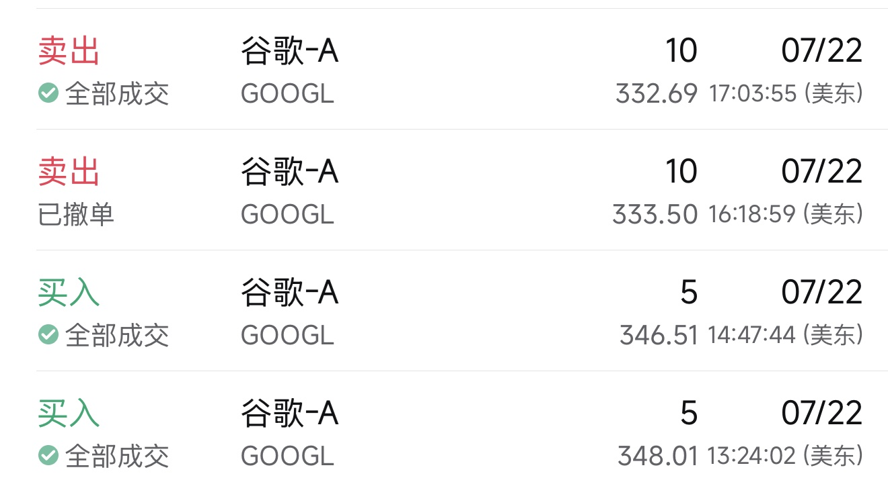
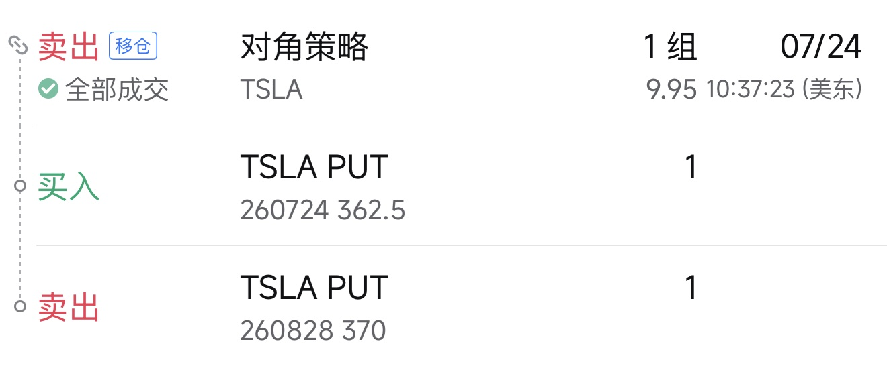
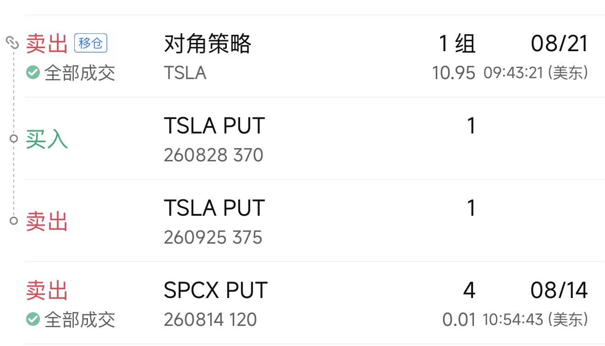
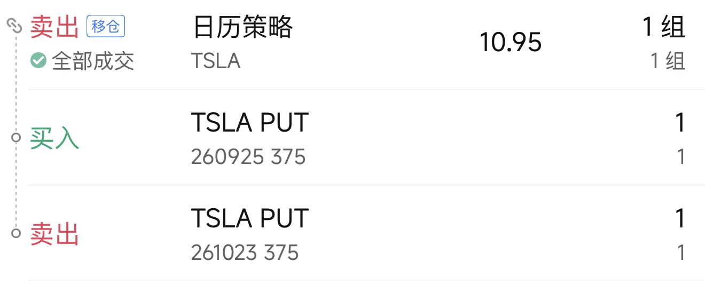

每到财报季，各个平台上充斥着赌财报的消息，这周就做两笔财报的赌约，目前以惨败收尾。

# Google的10股

在2026年7月22日收盘前，分别以348.01和346.51买入5股，一共10股Google,结果盘后发布财报，虽然营收和ESP都高于市场预期，但是由于资本支出导致本季自由现金流为负，所以股价下跌，愿赌服输，以332.69全部清仓，一共亏了145.7美元。

当时为什么要做一次赌约？其实是就是所谓的看好Google。为什么看好呢？

1. 因为从新闻上知道伯克希尔.哈撒韦加仓了Google,而且仓位不低。
2. 认为资本支出会稳定或者减少。

## 回顾
现在看来是不是很搞笑，没看一任何一页Google的财报或是甚至连Google的财报电话会议都没看过就赌，**以后坚决不赌财报了**。

---
# Tesla 的PUT
在2026年7月20号，在中午吃饭的时候，听到同事说卖了Tesla的PUT，因为它已经从近期的400左右跌到了370左右，**觉得**不会跌得再多了，所以卖了一个2026-07-24 行权价为362.5的PUT，**觉得**比较安全。结果到2026年7月24日收盘，Tesla 跌到313块，所以这个PUT亏了4102美元。

## 回顾
其实从我的认知来说，我是不是想碰Tesla，包括正股，但是当时还是动手了，主要有以下两个原因：

1. **觉得**它不会再跌到更低了。
2. **通过观察**它会在300-400之间波动，在一定的时间内会回到400美元。

# 后续
因为我不想认输，所以又Rollover了这个期权：

寄希望于：

1. 股价不会再跌；
2. 时间站在我这边，我会一直rollover这个基本，直到被提前行权或是无价值到期为止，因为这个不占用我的资金，同时随着时间的流逝，期权的时间价值总是要归零的。

# 2026-08-21, 因为Tesla的股价还没涨到370的价格，所以只能再rollover一个星期：

**当这个期权回本之后，如果一个股票我不想买它的正股，绝不操作它的期权**

# 2026-09-18, 上一个期权还有一周，但是目前的Tesla 的股价是362，所以只能再rollover一个星期：

不过我慢慢发现，如果它的股价总是在360附近徘徊，那么每个月rollover一次会变成一个生意，所以我现在期望它在375以下呆上一年。

这个人的想法，真是随着时间和情况变化而变化，忘了当时股价大跌的时候有多痛苦，现在每个有赚1000美元的权利金又变得喜滋滋的。当然原则不变，如果不想接正股，不要卖PUT。