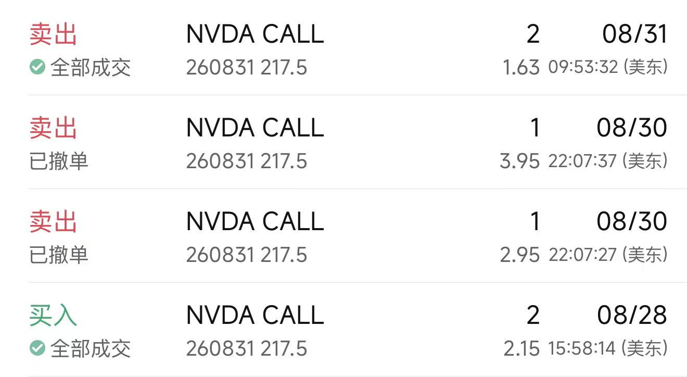
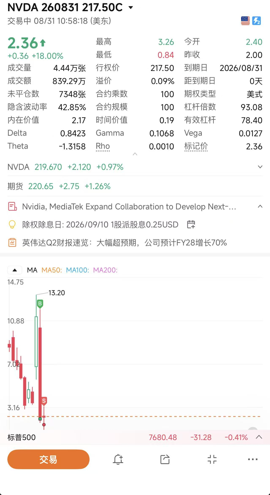
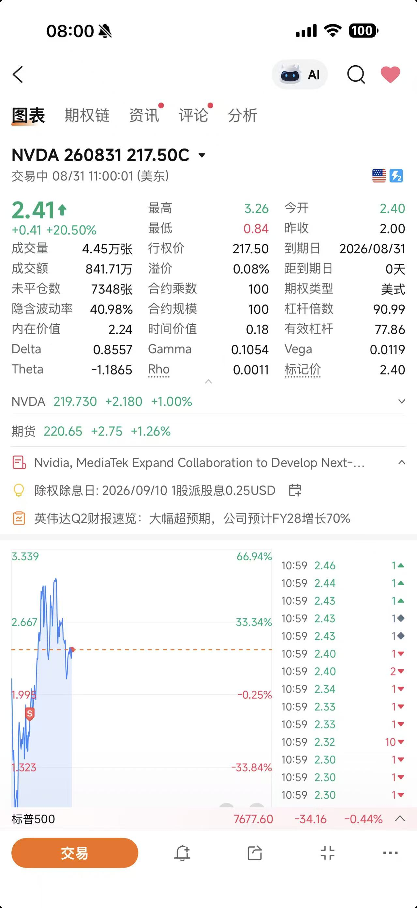

2026年8月28日，NVIDIA在财报大涨10%之后，居然跌了5%，我**认为**在基本面没有大变化的情况下，这个下跌毫无逻辑可言，我**觉得** 在下一个交易日，2026年8月31日会涨回来，所以我进行了如下操作：

1. 在收盘两分钟前，挂了2张2026年8月31到期，行权价为217.5的CALL，挂单价格是201美元一张。
2. 但是过了一分钟，没有成效，价格大约在225左右，所以我有点着急买不到，然后再订单改成市价单，立刻成交，价格在215，两张。
3. 成交之后，它的价格一路往下走，收盘在185。
4. 2026年8月30日，我想第二天如果它在早上就高开，那我就没有时间卖出，所以我挂了一张295美元的，另一张395美元。
5. 2026年8月31日，早上6：50左右，它的价格在165左右，我当时就非常纠结，是等着赌一把还是现在收手，虽然亏一点。
6. 然后我又开始**理智**起来了,决定收手，取消订单，然后挂了市价单，成交于163美元。

7. 更讽刺的来了，就在我把它们卖掉之后的半小时，它的价格猛涨，最高价到了326，可是又与我有什么关系呢？我只是一根被盲目自信和情绪控制着的**韭菜**。
---
# 看看我的成功时机：

# 然后再看看详情：

对于像我这样，平时买东西都比来比去的家伙，在买卖期权的时候，仅凭我**觉得**和**认为**就把430美元打水漂了，以后还干这种事情么？绝对不能再干了。